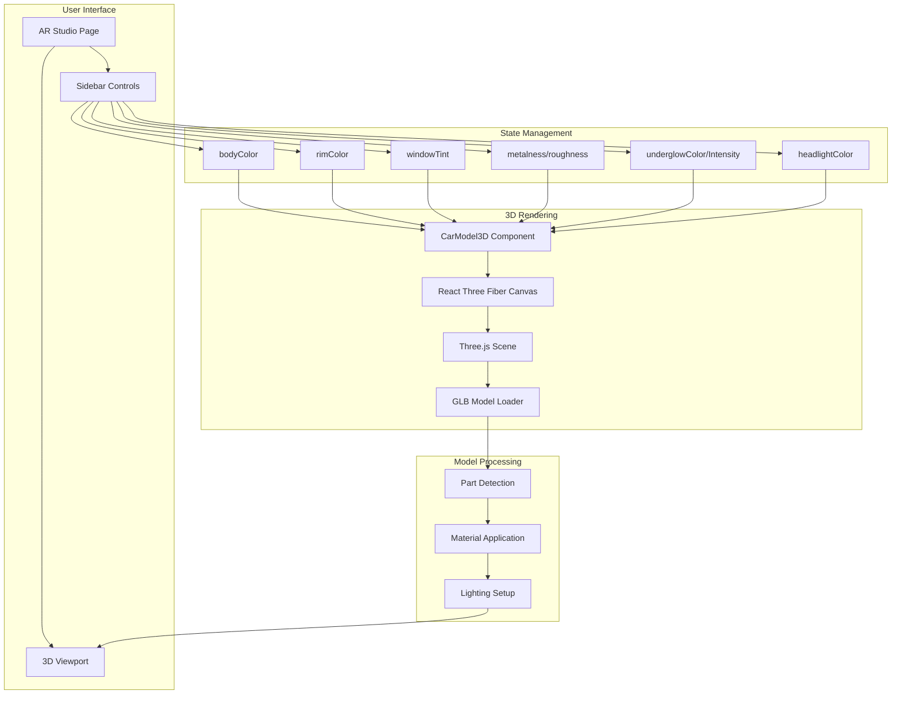
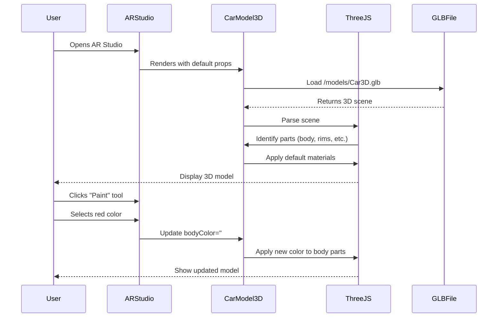
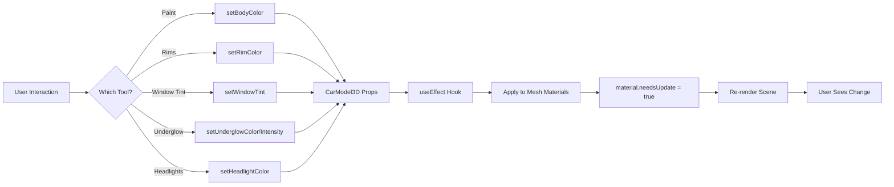
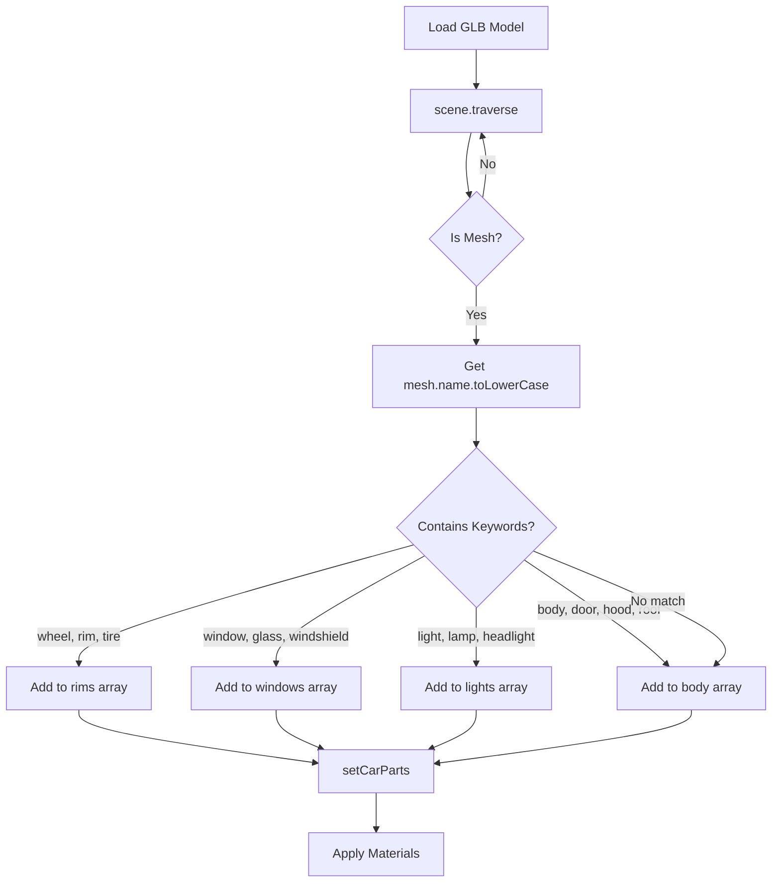
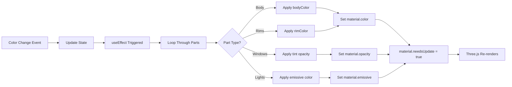
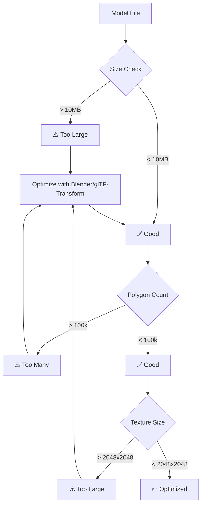
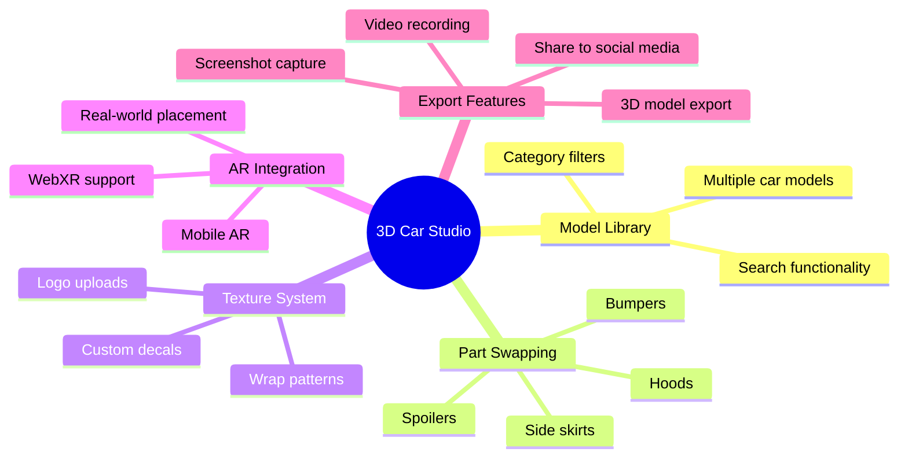
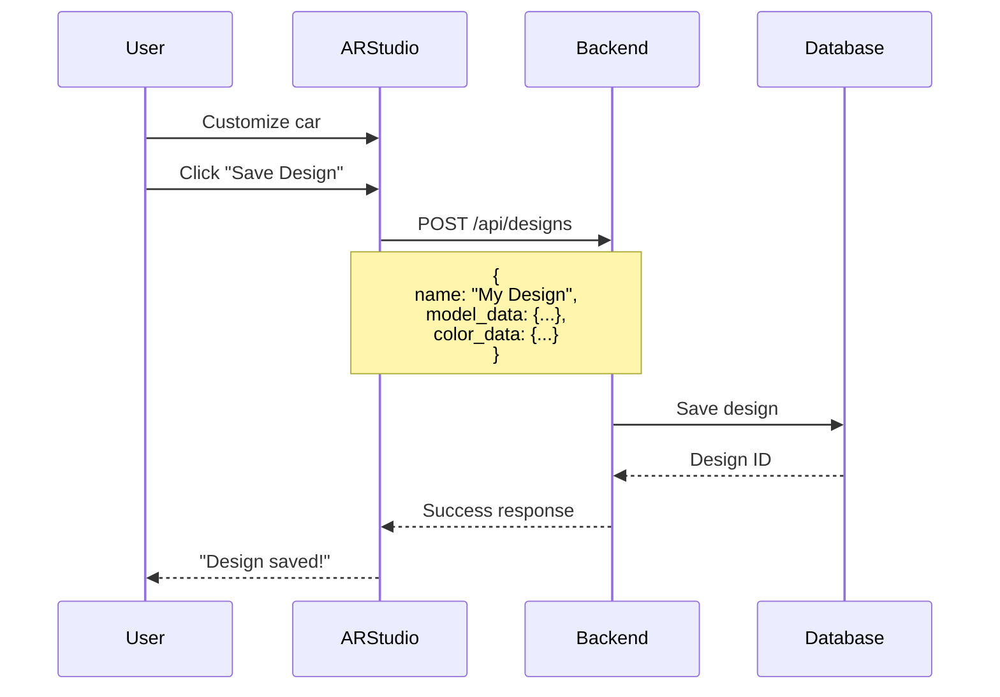
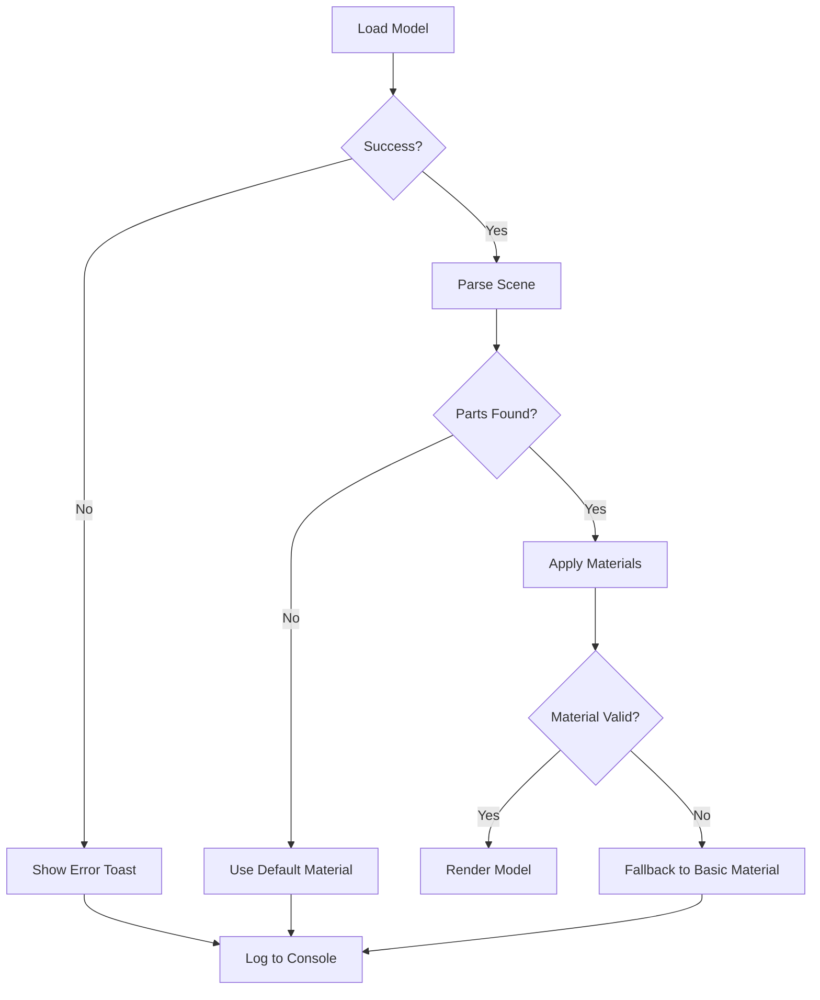

# 3D Car Model Architecture

## System Overview



## Component Flow



## Data Flow



## Part Detection Logic



## Material Application Process



## File Structure

```
CarVizion/
├── public/
│   └── models/
│       └── Car3D.glb          # 3D car model file
│
├── src/
│   ├── components/
│   │   └── CarModel3D.tsx     # 3D model component
│   │
│   └── pages/
│       └── ARStudio.tsx       # Main AR Studio page
│
└── docs/
    ├── 3D_MODEL_GUIDE.md      # Comprehensive guide
    ├── QUICK_START_3D.md      # Quick reference
    └── ARCHITECTURE.md        # This file
```

## Technology Stack

```mermaid
graph TB
    A[React 19] --> B[React Three Fiber]
    B --> C[Three.js]
    C --> D[WebGL]
    
    E[@react-three/drei] --> B
    F[GLB/GLTF Models] --> C
    
    G[TypeScript] --> A
    H[Tailwind CSS] --> A
```

## Key Technologies

| Technology | Purpose | Version |
|------------|---------|---------|
| **React** | UI Framework | 19.1.0 |
| **React Three Fiber** | React renderer for Three.js | 9.3.0 |
| **Three.js** | 3D graphics library | 0.179.1 |
| **@react-three/drei** | Helper components for R3F | 10.6.1 |
| **TypeScript** | Type safety | 5.8.3 |

## Performance Considerations



## Optimization Strategies

1. **Model Optimization:**
   - Use Draco compression for GLB files
   - Reduce polygon count with Decimate modifier
   - Merge duplicate vertices
   - Remove hidden geometry

2. **Texture Optimization:**
   - Compress textures (JPEG for color, PNG for alpha)
   - Use power-of-2 dimensions (512, 1024, 2048)
   - Share textures between similar parts

3. **Runtime Optimization:**
   - Preload models with `useGLTF.preload()`
   - Use `useMemo` for expensive calculations
   - Implement level-of-detail (LOD) for complex models
   - Disable shadows if not needed

## Future Enhancements



## API Integration Points



## State Management Pattern

```typescript
// ARStudio.tsx
const [bodyColor, setBodyColor] = useState("#ff5e1a");

// User clicks color
<button onClick={() => setBodyColor("#ff0000")} />

// Props passed to 3D component
<CarModel3D bodyColor={bodyColor} />

// CarModel3D.tsx
useEffect(() => {
  carParts.body.forEach((mesh) => {
    mesh.material.color = new THREE.Color(bodyColor);
    mesh.material.needsUpdate = true;
  });
}, [carParts, bodyColor]);
```

## Error Handling



---

## Quick Reference

### Adding a New Customization Option

1. **Add state in ARStudio.tsx:**
   ```tsx
   const [spoilerColor, setSpoilerColor] = useState("#000000");
   ```

2. **Add UI control:**
   ```tsx
   <Button onClick={() => setSpoilerColor("#ff0000")}>
     Red Spoiler
   </Button>
   ```

3. **Pass to CarModel3D:**
   ```tsx
   <CarModel3D spoilerColor={spoilerColor} />
   ```

4. **Apply in CarModel3D:**
   ```tsx
   useEffect(() => {
     carParts.spoiler.forEach((mesh) => {
       mesh.material.color = new THREE.Color(spoilerColor);
     });
   }, [spoilerColor]);
   ```

### Debugging Tips

1. **Check model loaded:**
   ```tsx
   console.log('Scene:', scene);
   ```

2. **Verify parts detected:**
   ```tsx
   console.log('Car parts:', carParts);
   ```

3. **Inspect materials:**
   ```tsx
   scene.traverse((child) => {
     if (child instanceof THREE.Mesh) {
       console.log(child.name, child.material);
     }
   });
   ```

---

**For more details, see:**
- [3D Model Guide](./3D_MODEL_GUIDE.md)
- [Quick Start](./QUICK_START_3D.md)
